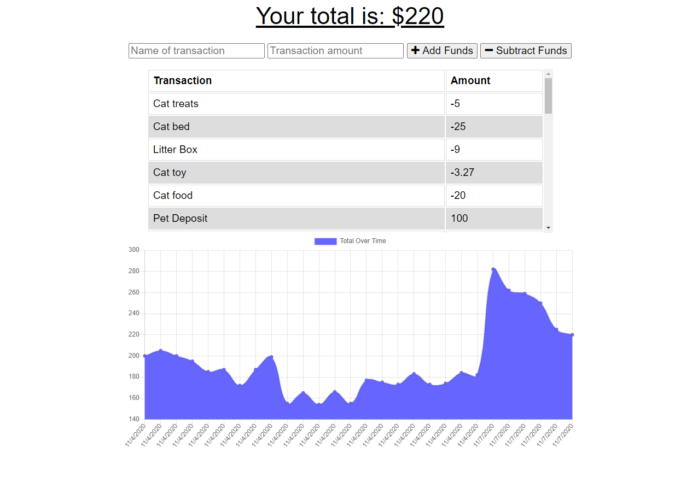

# Budget Tracker

https://pwabudgettracking.herokuapp.com/

Table Of Contents:

- [Section 1: Introduction](#introduction)
- [Section 2: Installation](#installation)
- [Section 3: Usage](#usage)
- [Section 4: License](#license)
- [Section 5: Credits](#credits)

## Introduction:

Budget tracking application that can be downloaded as a PWA to use for logging deposits and debits offline as well as online. It will add your offline deposits to the database once the application returns online.

## Installation:

You can use this application in browser, and also download it to your desktop or homescreen as a PWA. From there it can be run either on or offline.

## Usage:

You can use this code any way you like in accord with the GNU license. Simply download the source files from the github repo.

## License:

GNU General Public License v3.0

## Credits:

Study Group!
- [Mando Estrada](https://github.com/Mando619)
-  [Johnny Lieu](https://github.com/johnnylieu)

## Questions: 

You can contact me with questions via:
- [Email](plover.brown@gmail.com)
- [GitHub](https://www.github.com/rebrasshopper)
- [LinkedIn](https://www.linkedin.com/in/plover-brown-37b6981a5)
